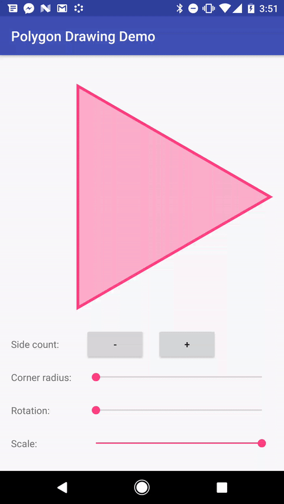

# PolygonDrawingUtil

An efficient Android utility class for drawing regular polygons on a [`Canvas`](https://developer.android.com/reference/android/graphics/Canvas.html).

Consumers can specify:

- number of sides (≥ 3);
- center coordinates;
- outer radius (center to vertex);
- corner rounding radius;
- polygon rotation;
- fill/stroke [`Paint`](https://developer.android.com/reference/android/graphics/Paint.html).

# Demo

This video was captured using the sample application in this repository. It provides convenient controls for exploring `PolygonDrawingUtil`'s parameter space.

# Getting Started

## Integration

1. Copy the [`PolygonDrawingUtil` class](https://raw.githubusercontent.com/stkent/PolygonDrawingUtil/master/app/src/main/java/com/stkent/polygondrawingutil/PolygonDrawingUtil.java) into your app's source directory.

2. Update the class package statement.

3. If your project does not already depend either directly or indirectly (e.g. via appcompat-v7) on the [Android Support Annotations package](https://developer.android.com/studio/write/annotations.html), follow [these instructions](https://developer.android.com/studio/write/annotations.html#adding-library) to add that package as a dependency of your project.

## Usage

1. Create a new `PolygonDrawingUtil` instance and assign it to a field in your custom view code.

2. Call `polygonDrawUtil.drawPolygon` in your `onDraw` method!

# TODO

- Distribute via jCenter.

# License

	Copyright 2017 Stuart Kent

	Licensed under the Apache License, Version 2.0 (the "License");
	you may not use this file except in compliance with the License.
	You may obtain a copy of the License at

	   http://www.apache.org/licenses/LICENSE-2.0

	Unless required by applicable law or agreed to in writing, software
	distributed under the License is distributed on an "AS IS" BASIS,
	WITHOUT WARRANTIES OR CONDITIONS OF ANY KIND, either express or implied.
	See the License for the specific language governing permissions and
	limitations under the License.
